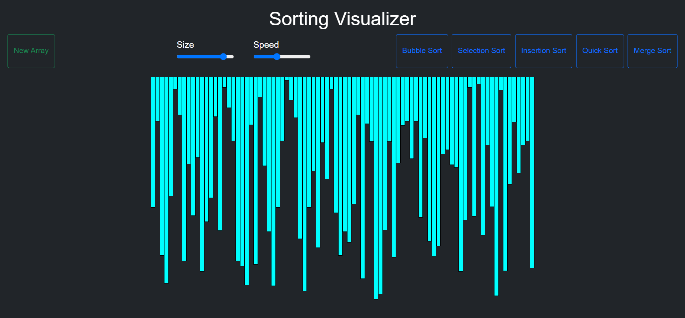
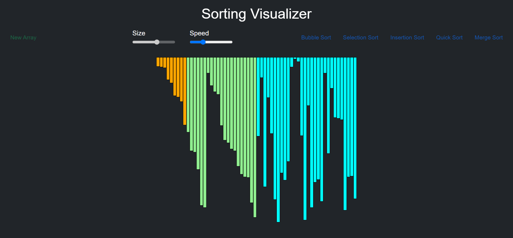
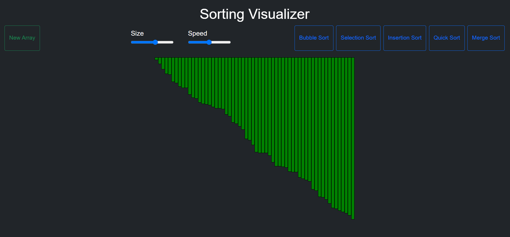

# Sorting-Visualizer

The Sorting Visualizer is an interactive project created with JavaScript that allows you to visualize the working of various sorting algorithms used in computer science. It's a valuable educational tool for understanding and comparing different sorting techniques.

### The project includes the following sorting algorithms:

- Bubble Sort
- Selection Sort
- Insertion Sort
- Quick Sort
- Merge Sort

### How to Use:

To use the Sorting Visualizer, simply open the HTML file in your web browser. You can choose from the available sorting algorithms and see them in action. This project serves as an excellent resource for learning and teaching sorting algorithms.

<!-- [Check out the website here](https://sheikhsuhail19.github.io/Sorting-Visualizer/) -->

This project not only aids in understanding sorting algorithms but also provides an engaging and interactive learning experience. Explore the sorting process and gain insights into how these algorithms work.

### Working images of project

  
  
  
